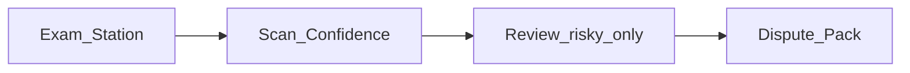

# Unique features — concrete build plan

**Status:** Scoped from the differentiation menu (vs ZipGrade / EvalBee).  
**Not started in code yet** — this document is the implementation contract.

## Pillars chosen

Default shortlist from the options menu (demo positioning: *the phone grader that doesn’t lie on exam day*):

| # | Menu option | Product name |
|---|-------------|--------------|
| 1 | Exam-day confidence coach | **Scan Confidence** |
| 2 | One-phone exam station mode | **Exam Station** |
| 4 | Dispute-safe grade audit trail | **Dispute Pack** |

**Out of scope for this build:** options 3, 5, 6, 7, 8, 9 (identity lock deepen, shared-key UX, remediation, proctor pack, offline merge, admin dashboard).

---

## Existing foundations (reuse, do not rewrite)

| Piece | Where |
|-------|--------|
| Review-before-save + Auto forces Review | [`lib/pages/scanner_page.dart`](lib/pages/scanner_page.dart) |
| Review UI + A–F choices | [`lib/pages/scan_review_page.dart`](lib/pages/scan_review_page.dart) |
| `reviewReasons`, `flaggedQuestions`, `needsReview`, local `scannedImagePath` | [`lib/models/exam_data.dart`](lib/models/exam_data.dart) `ScanResult` |
| Local JPEG snapshot for flagged sheets | `_saveReviewSnapshot` in `scanner_page.dart` (never uploaded — [`PRIVACY.md`](PRIVACY.md)) |
| Dashboard review queue | [`lib/widgets/dashboard/review_queue_card.dart`](lib/widgets/dashboard/review_queue_card.dart) |
| Section × subject progress board | [`lib/pages/exam_day_board_page.dart`](lib/pages/exam_day_board_page.dart), [`lib/services/exam_day_board_service.dart`](lib/services/exam_day_board_service.dart) |
| Continuous / Auto capture | `scanner_page.dart` (`_isContinuousMode`, `_batchResults`) |
| Native light-mark / dense-custom debug keys | Android `OmrProcessor.kt`, iOS `OmrNativeBridge.mm` |

---

## Pillar 1 — Scan Confidence (exam-day coach)

### Goal

After each scan (and on the batch / board), show a **teacher-facing risk card**: what might be wrong, how serious it is, and one tap to Review — without flooding solid dense-custom marks as “light.”

### Screens / UX

1. **Post-scan confidence strip** (scanner overlay / toast upgrade)  
   - States: `Safe to keep` | `Check before counting` | `Must review`  
   - Show top 1–3 reasons in plain language (blank count, double marks, low confidence, section mismatch, light marks **only when marginal**).  
   - Primary CTA: **Review this sheet** when not Safe.

2. **Batch end summary** (after leaving scanner or “End station”)  
   - Counts: safe / needs review / discarded.  
   - List risky OMR IDs → open existing review flow.

3. **Exam Day Board integration**  
   - Reuse `ExamDayStatus.needsReview` + `statusDetail`; ensure coach reasons match board copy (one vocabulary).

### Files to touch

| Action | File |
|--------|------|
| Add | `lib/services/scan_confidence_service.dart` — maps `ScanResult` + native `debugInfo` → `ScanConfidenceLevel` + teacher strings |
| Add | `lib/widgets/scan_confidence_card.dart` |
| Add | `test/scan_confidence_service_test.dart` |
| Edit | `lib/pages/scanner_page.dart` — show card after save / instead of vague toast when risky |
| Edit | `lib/pages/exam_day_board_page.dart` — optional confidence badge on review rows |
| Edit | `lib/widgets/dashboard/review_queue_card.dart` — align severity colors with coach |

### Risks

| Risk | Mitigation |
|------|------------|
| Dense custom floods “light mark” again | Coach must use the same **marginal** rule as native (`isMarginalAcceptedMark`); never flag all area &lt; 0.28 |
| Teachers ignore the card | Only interrupt / force Review when level is Must review; Safe stays toast-sized |
| Duplicate vocabulary vs Review page | Single service owns reason strings; Review + Board consume it |

### Acceptance

- Safe scan: no full-screen block; short success feedback.  
- Risky scan: card shows ≥1 actionable reason + Review CTA.  
- Unit tests cover blank / multi-mark / low confidence / clean map.  
- No change to bubble geometry or native thresholds in this pillar (UI only unless a mapping bug is found).

---

## Pillar 2 — Exam Station (one-phone exam mode)

### Goal

A locked midterm/finals flow: pick subject (+ section) → Auto scan → big “next student” feedback → live roster progress → end summary. No dashboard wandering mid-exam.

### Screens / UX

1. **Enter Exam Station** from Section detail (near existing Exam Day Board entry) and/or Dashboard Scan.  
   - Confirm subject, section, Review-before-save on, Auto preferred.  
   - Full-screen scanner chrome: hide Settings / Turbo deep links behind a single “Exit station” control.

2. **Station HUD**  
   - Top: subject + section.  
   - Center: camera (existing).  
   - Bottom: `Scanned N / Roster M` · `Need review K` · last student name + score or “Queued for review”.  
   - After save: large check or amber “Review” chip for ~1.5s, then “Place next sheet”.

3. **End Station**  
   - Summary sheet: done / missing / review / duplicates (reuse `ExamDayBoardService.build`).  
   - CTAs: **Open Exam Day Board**, **Review queue**, **Done**.

### Files to touch

| Action | File |
|--------|------|
| Add | `lib/pages/exam_station_page.dart` — thin shell that hosts scanner + HUD + end summary |
| Add | `lib/widgets/exam_station_hud.dart` |
| Edit | `lib/pages/scanner_page.dart` — optional `ExamStationConfig` / callbacks (`onAcceptedScan`, hide non-station chrome) **without** forking the OMR pipeline |
| Edit | `lib/pages/section_detail_page.dart` — “Exam Station” entry next to Exam Day Board |
| Edit | `lib/utils/scanner_launch.dart` — launch helper for station mode |
| Add | `test/exam_station_progress_test.dart` — progress math from board report |

### Risks

| Risk | Mitigation |
|------|------------|
| Duplicate scanner logic | Station wraps `ScannerPage`; no second OpenCV path |
| Auto + Review already pauses continuous | Keep current pause/resume; HUD must not start a second poller |
| Teacher exits mid-exam | Exit confirmation: “Scans already saved stay saved” |
| Wrong section scanned | Keep existing identity checks; station does not relax them |

### Acceptance

- From section → Exam Station → scan ≥2 sheets → HUD counts match board.  
- Exit mid-station preserves saved scans.  
- End summary matches `ExamDayBoardService` for that section/subject.  
- Manual capture still available if Auto is off (station does not force Auto if camera fails).

---

## Pillar 4 — Dispute Pack (local audit trail)

### Goal

For flagged or teacher-edited scores: keep enough **local** evidence to answer “why did this student get this grade?” — snapshot, original machine answers, edited answers, timestamps — and export a one-page dispute PDF. **Photos stay on device** (no cloud upload).

### Data model

Extend local scan persistence (minimal schema change):

| Field | Purpose |
|-------|---------|
| `scannedImagePath` | Already exists |
| `originalDetectedAnswers` (new JSON) | Machine output before Review edits |
| `editedAnswers` / final = `detectedAnswers` | Already final answers |
| `manuallyConfirmed` + edit flag | Already have `manuallyConfirmed`; add `wasEdited` bool if not persisted |
| `reviewResolvedAt` | When teacher confirmed Review |

Prefer columns on `scan_results` via existing migration helpers in [`lib/services/local_data_store.dart`](lib/services/local_data_store.dart). Do **not** sync image bytes or dispute PDFs to Laravel unless product policy changes (`PRIVACY.md` update required first).

### Screens / UX

1. **Student / scan detail** — “Dispute pack” button when snapshot or edit history exists.  
2. **PDF one-pager** — student name, OMR ID, subject, section, score, confidence, review reasons, side-by-side original vs final answers (flagged Qs only if long), embedded snapshot if file still on disk.  
3. Share via existing share/print patterns (`printing` / `share_plus`).

### Files to touch

| Action | File |
|--------|------|
| Edit | `lib/models/exam_data.dart` — audit fields on `ScanResult` |
| Edit | `lib/services/local_data_store.dart` — migrate + read/write |
| Edit | `lib/pages/scanner_page.dart` / review save path — store originals before overwrite |
| Add | `lib/services/dispute_pack_service.dart` — build PDF bytes |
| Add | `lib/pages/dispute_pack_preview_page.dart` (or bottom sheet) |
| Edit | `lib/pages/omr_id_list_page.dart` or section student scan list — entry point |
| Edit | [`PRIVACY.md`](PRIVACY.md) — document dispute pack stays local |
| Add | `test/dispute_pack_service_test.dart` |

### Risks

| Risk | Mitigation |
|------|------------|
| Disk full / missing snapshot | PDF still exports answers + reasons; show “Image no longer on this phone” |
| Cloud sync accidentally sends paths | Sync payload excludes image bytes and local paths (verify `cloud_sync_service.dart`) |
| Large answer keys (200 Q) | Dispute PDF lists only flagged + changed questions + totals |
| Schema migration on old installs | Additive columns with defaults; backfill originals = detected when missing |

### Acceptance

- Review edit → saved scan retains original ≠ final when answers changed.  
- Dispute PDF generates offline and shares.  
- Sync / backup JSON does not upload JPEG.  
- Teacher can open pack from student history for a reviewed scan.

---

## Implementation order

1. **Scan Confidence** (lowest risk, unlocks the trust story; feeds Station + Board copy).  
2. **Exam Station** (wraps scanner + board; uses Confidence in HUD).  
3. **Dispute Pack** (needs reliable originals from Review path; do after Confidence vocabulary is stable).

Ship behind normal production rules: `flutter analyze`, `flutter test`, bump `pubspec.yaml` version, release APK via `scripts/build_release.ps1` / `--dart-define-from-file=secrets.json`.

## Explicit non-goals (this initiative)

- No student portal / SMS / WhatsApp  
- No new half/quarter sheet forms  
- No loosening dense-custom scan floors to chase ZipGrade speed  
- No mid-exam cloud multi-device merge (option 8)  
- No admin web dashboard rewrite (option 9)

## Definition of done for the initiative

- All three pillars shipped and covered by tests above.  
- Teacher-facing demo script: Exam Station → Confidence card on a risky sheet → Review → Dispute Pack PDF.  
- Positioning line in teacher materials (optional follow-up): *COC OMR — scan, trust, prove the grade.*
